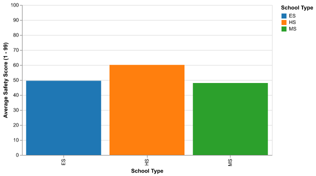
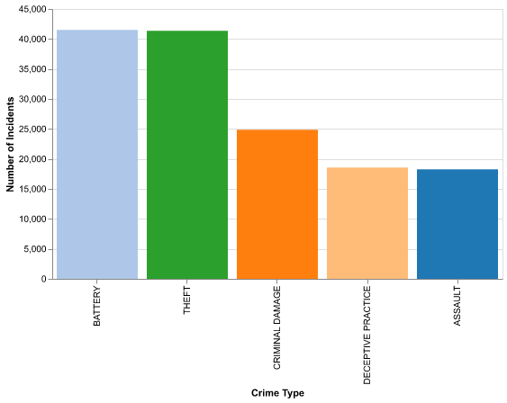

# IS 445 Final Project Jekyll Webpage - Chicago Public Schools Data Journalism (2011 - 2012)

## What Makes a School Thrive?

Imagine sending your child to a school where they feel safe, show up every day, & excel in reading. In 2011 - 2012, Chicago Public Schools tracked these very things — safety, attendance, & reading performance — for over 500 schools. We explored this [data](https://data.cityofchicago.org/api/views/9xs2-f89t/rows.csv) to see how these factors connect. Our interactive chart below lets you explore how attendance & reading success might relate to safety across elementary, middle, & high schools. Click on dots to see specific schools & their details — it’s a window into what was happening in Chicago’s classrooms over a decade ago.

## Explore Attendance & Reading Success

<vegachart schema-url = "{{ site.baseurl }}/assets/json/scatter_chart.json" style = "width: 100%"></vegachart>

Click on dots (Hold Shift for multiple) to see school details. Colors show school types: Elementary (ES), Middle (MS), High (HS).

## Safety’s Role in Learning

The chart above shows each school as a dot. Schools with higher attendance (Further right) often have more students exceeding reading standards (Higher up), especially elementary schools (Blue dots). But what about safety? When you click on a dot, you’ll see a safety score from 1 to 99, based on things like discipline incidents & student surveys. We found high schools (Red dots) tend to cluster lower on both attendance & reading, hinting safety might play a role. To further explore, we paired this with [crime data](https://data.cityofchicago.org/api/views/qzdf-xmn8/rows.csv) from Chicago’s neighborhoods & statewide school trends — check out the visuals below to see the bigger picture.

## How Safe Are Chicago Schools by Type?

Average safety scores for Chicago schools by type, calculated from our primary dataset.

Top 5 crime types reported in Chicago in 2011, based on Chicago Crime Data.

## Putting It All Together

Chicago’s schools don’t exist in a bubble — neighborhood safety matters too. Our 1st bar chart shows elementary schools scored highest on safety (Around 50 out of 99), while high schools lagged (Closer to 40). The 2nd chart reveals theft & battery topped Chicago’s crime list in 2011, suggesting challenges near some schools, especially high schools with lower attendance & reading scores. National data from the U.S. Department of Education shows school safety — like fights or theft — is a widespread issue, & Illinois data hints Chicago’s struggles were typical for urban areas. Together, these clues suggest improving safety, both inside schools & out, could improve attendance & learning. What do you think — how should Chicago tackle this today?

## Where We Got Our Data
- **Primary Dataset:** Chicago Public Schools - Progress Report Cards (2011 - 2012). Available at [https://data.cityofchicago.org/api/views/9xs2-f89t/rows.csv](https://data.cityofchicago.org/api/views/9xs2-f89t/rows.csv).    
- **Contextual Dataset Source:** Chicago Crime Data (2011). Download from [https://data.cityofchicago.org/api/views/qzdf-xmn8/rows.csv](https://data.cityofchicago.org/api/views/qzdf-xmn8/rows.csv).
- **Contextual Dataset Source 2:** National school safety trends referenced from NCES Condition of Education, 'School Crime and Safety' indicator, at [https://nces.ed.gov/programs/coe/indicator/cgb](https://nces.ed.gov/programs/coe/indicator/cgb).

## Search The Data & Methods

Below are links to the dataset & the Python notebook used to generate these visualizations (Note: GitHub doesn't display the plots in the `Final_Project_Workbook.ipynb` file, but `nbviewer` does [here](https://nbviewer.org/github/TheWongLife1/TheWongLife1.github.io/blob/main/python_notebooks/Final_Project_Workbook.ipynb)).

  
 

  
 